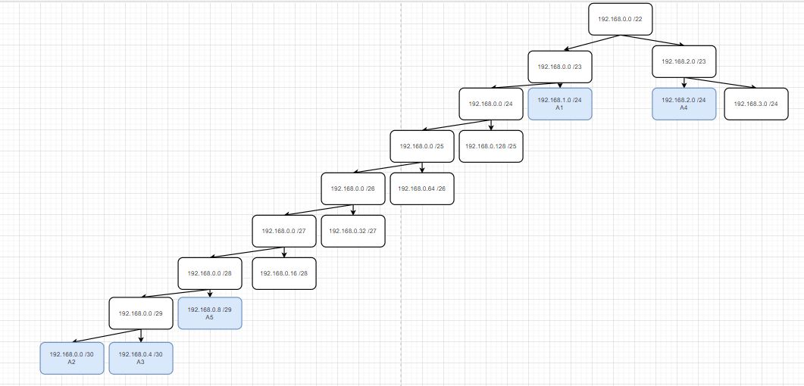
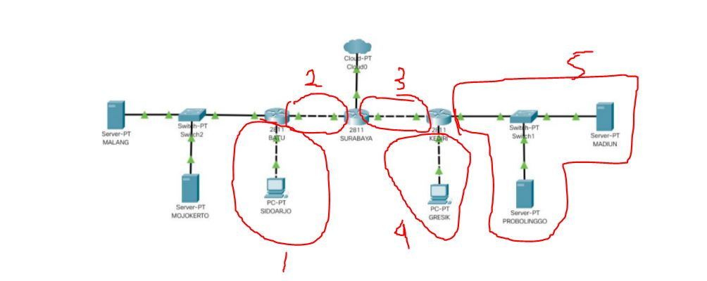

# Jarkom_Modul5_Lapres_A06

## Kelompok A06
- 5111840000124	-	Sandra Agnes Oktaviana
- 5111840000165	-	Muhammad Fikri Rabbani

## B. Subnetting
## Tree


## Pembagian 


## A. Topologi
```
# Switch
uml_switch -unix switch1 > /dev/null < /dev/null &
uml_switch -unix switch2 > /dev/null < /dev/null &
uml_switch -unix switch3 > /dev/null < /dev/null &
uml_switch -unix switch4 > /dev/null < /dev/null &
uml_switch -unix switch5 > /dev/null < /dev/null &
uml_switch -unix switch6 > /dev/null < /dev/null &

# Router
xterm -T SURABAYA -e linux ubd0=SURABAYA,jarkom umid=SURABAYA eth0=tuntap,,,10.151.72.29 eth1=daemon,,,switch4 eth2=daemon,,,switch3 mem=64M &
xterm -T BATU -e linux ubd0=BATU,jarkom umid=BATU eth0=daemon,,,switch3 eth1=daemon,,,switch2 eth2=daemon,,,switch1 mem=64M &
xterm -T KEDIRI -e linux ubd0=KEDIRI,jarkom umid=KEDIRI eth0=daemon,,,switch4 eth1=daemon,,,switch6 eth2=daemon,,,switch5 mem=64M &

# Server
xterm -T MALANG -e linux ubd0=MALANG,jarkom umid=MALANG eth0=daemon,,,switch1 mem=64M &
xterm -T MOJOKERTO -e linux ubd0=MOJOKERTO,jarkom umid=MOJOKERTO eth0=daemon,,,switch1 mem=64M &
xterm -T MADIUN -e linux ubd0=MADIUN,jarkom umid=MADIUN eth0=daemon,,,switch6 mem=64M &
xterm -T PROBOLINGGO -e linux ubd0=PROBOLINGGO,jarkom umid=PROBOLINGGO eth0=daemon,,,switch6 mem=64M &

# Client
xterm -T SIDOARJO -e linux ubd0=SIDOARJO,jarkom umid=SIDOARJO eth0=daemon,,,switch2 mem=64M &
xterm -T GRESIK -e linux ubd0=GRESIK,jarkom umid=GRESIK eth0=daemon,,,switch5 mem=64M &
```

## Perhitungan Netmask
```
SIDOARJO	: 200		
GRESIK		: 210		

 Subnet		Jumlah IP	Netmask	
A1		201		/24
A2		2		/30
A3		2		/30
A4		211		/24
A5		5		/29

Total		421		/23
```

## Range IP
```
A1 192.168.1.0
Batu 192.168.1.1
Sidoarjo 192.168.1.2

A2 192.168.0.0
Batu 192.168.0.1
Surabaya 192.168.0.2

A3 192.168.0.4
Surabaya 192.168.0.5
Kediri 192.168.0.6

A4 192.168.2.0
Kediri 192.168.2.1
Gresik 192.168.2.2

A5 192.168.0.8
Kediri 192.168.0.9
Probolinggo 192.168.0.10
Madiun 192.168.0.11
```

## Interface
```
[MALANG]
auto lo
iface lo inet loopback

auto eth0
iface eth0 inet static
address 10.151.73.60
netmask 255.255.255.248
gateway 10.151.73.62


[MOJOKERTO]
auto lo
iface lo inet loopback

auto eth0
iface eth0 inet static
address 10.151.73.61
netmask 255.255.255.248
gateway 10.151.73.62


[BATU]
auto lo
iface lo inet loopback

auto eth0
iface eth0 inet static
address 192.168.0.2
netmask 255.255.255.252
gateway 192.168.0.1

auto eth1
iface eth1 inet static
address 192.168.1.1
netmask 255.255.255.0

auto eth2
iface eth2 inet static
address 10.151.73.62
netmask 255.255.255.248


[SIDOARJO]
auto lo
iface lo inet loopback

auto eth0
iface eth0 inet static
address 192.168.1.2
netmask 255.255.255.0
gateway 192.168.1.1


[SURABAYA]
auto lo
iface lo inet loopback

auto eth0
iface eth0 inet static
address 10.151.72.30
netmask 255.255.255.252
gateway 10.151.72.29

auto eth1
iface eth1 inet static
address 192.168.0.5
netmask 255.255.255.252

auto eth2
iface eth2 inet static
address 192.168.0.2
netmask 255.255.255.252


[KEDIRI]
auto lo
iface lo inet loopback

auto eth0
iface eth0 inet static
address 192.168.0.6
netmask 255.255.255.252
gateway 192.168.0.5

auto eth1
iface eth1 inet static
address 192.168.0.9
netmask 255.255.255.248

auto eth2
iface eth2 inet static
address 192.168.2.1
netmask 255.255.255.0


[GRESIK]
auto lo
iface lo inet loopback

auto eth0
iface eth0 inet static
address 192.168.2.2
netmask 255.255.255.0
gateway 192.168.2.1


[PROBOLINGGO]
auto lo
iface lo inet loopback

auto eth0
iface eth0 inet static
address 192.168.0.10
netmask 255.255.255.248
gateway 192.168.0.9


[MADIUN]
auto lo
iface lo inet loopback

auto eth0
iface eth0 inet static
address 192.168.0.11
netmask 255.255.255.248
gateway 192.168.0.9
```


## C. Routing 

- Pada setiap router setting sysctl: ` nano /etc/sysctl.conf` lalu hapus tagar pada `net.ipv4.ip_forward=1`

- bash `sysctl -p`

- buat route.sh pada setiap router;

pada SURABAYA

```
route add -net 192.168.1.0 netmask 255.255.255.0 gw 192.168.0.2
route add -net 192.168.2.0 netmask 255.255.255.0 gw 192.168.0.6
route add -net 192.168.0.8 netmask 255.255.255.248 gw 192.168.0.2
route add -net 10.151.73.56 netmask 255.255.255.248 gw 192.168.0.6
```

pada BATU
```
route add -net 0.0.0.0 netmask 0.0.0.0 gw 192.168.0.5
```

pada KEDIRI
`route add -net 0.0.0.0 netmask 0.0.0.0 gw 192.168.0.1`

- `bash route.sh`

## D. DHCP Server 

- Pada SIDOARJO dan GRESIK ubah konfigurasi interface
```
auto eth0
iface eth0 inet dhcp
```

- install dhcp-server `apt-get install isc-dhcp-server`
- konfigurasi interfaces `INTERFACESv4="eth0"` dengan `nano /etc/default/isc-dhcp-server`
- restart `service isc-dhcp-server restart`

### DHCP Relay
pada SURABAYA, KEDIRI, BATU

- install dhcp-relay `apt-get install isc-dhcp-relay` 
- konfigurasi interface `nano /etc/default/isc-dhcp-relay`
- server MOJOKERTO `SERVERS="10.151.73.59"` dan interfaces:

pada SURABAYA: `INTERFACES="eth1 eth2"`

pada KEDIRI: `INTERFACES="eth0 eth2"`

pada BATU: `INTERFACES="eth0 eth1 eth2"`

- restart `service isc-dhcp-relay restart`


## soal 1
Agar topologi yang kalian buat dapat mengakses keluar, kalian diminta untuk mengkonfigurasi
SURABAYA menggunakan iptables, namun Bibah tidak ingin kalian menggunakan
MASQUERADE.

pada SURABAYA buat file route1.sh
`iptables -t nat -A POSTROUTING -s 192.168.0.0/22 -o eth0 -j SNAT --to-source 10.151.72.30`

lalu jalankan `bash route1.sh`


# soal 2
Kalian diminta untuk mendrop semua akses SSH dari luar Topologi (UML) Kalian pada server
yang memiliki ip DMZ (DHCP dan DNS SERVER) pada SURABAYA demi menjaga keamanan.

pada SURABAYA buat file route2.sh
`iptables -A FORWARD -d 10.151.73.56/29 -i eth0 -p tcp --dport 22 -j DROP`

lalu jalankan `bash route2.sh`

- di putty buat koneksi ssh ke MALANG `nc 10.151.73.59 22` 

- cek di Malang dengan `nc -l -p 22` apakah paket berhasil di drop / tidak muncul paket yang sama.

## soal 3
Karena tim kalian maksimal terdiri dari 3 orang, Bibah meminta kalian untuk membatasi DHCP
dan DNS server hanya boleh menerima maksimal 3 koneksi ICMP secara bersamaan yang berasal dari
mana saja menggunakan iptables pada masing masing server, selebihnya akan di DROP.

pada MALANG dan MOJOKERTO buat file route3.sh
`iptables -A INPUT -p icmp -m connlimit --connlimit-above 3 --connlimit-mask 0 -j DROP`

- bash route3.sh

- cek dengan ping MALANG/MOJOKERTO sebanyak 4 kali dari UML berbeda, maka yang ke 4 tidak bisa


kemudian kalian diminta untuk membatasi akses ke MALANG yang berasal dari SUBNET
SIDOARJO dan SUBNET GRESIK dengan peraturan sebagai berikut:
## (4) Akses dari subnet SIDOARJO hanya diperbolehkan pada pukul 07.00 - 17.00 pada hari Senin sampai Jumat.

pada MALANG buat file route4.sh
```
iptables -A INPUT -s 192.168.2.0/24 -m time --timestart 07:00 --timestop 17:00 --weekdays Mon,Tue,Wed,Thu,Fri -j ACCEPT
iptables -A INPUT -s 192.168.2.0/24 -j REJECT 
```

- bash route4.sh

- cek dengan ping MALANG dari SIDOARJO
akses hanya dapat pada jadwal yang diperbolehkan


## (5) Akses dari subnet GRESIK hanya diperbolehkan pada pukul 17.00 hingga pukul 07.00 setiap harinya. Selain itu paket akan di REJECT.

Karena kita memiliki 2 buah WEB Server, 

## (6) Bibah ingin SURABAYA disetting sehingga setiap request dari client yang mengakses DNS Server akan didistribusikan secara bergantian pada PROBOLINGGO port 80 dan MADIUN port 80.


## (7) Bibah ingin agar semua paket didrop oleh firewall (dalam topologi) tercatat dalam log pada setiap
UML yang memiliki aturan drop.
Bibah berterima kasih kepada kalian karena telah mau membantunya. Bibah juga mengingatkan agar
semua aturan iptables harus disimpan pada sistem atau paling tidak kalian menyediakan script sebagai
backup


